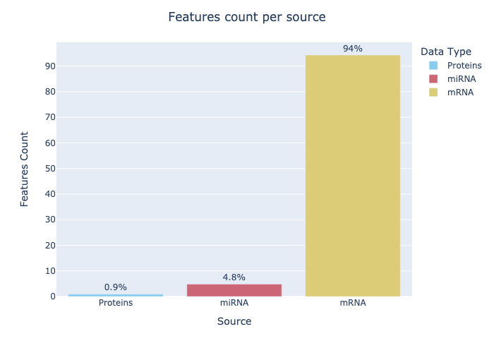
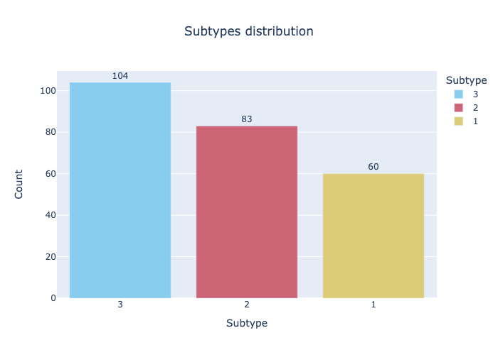
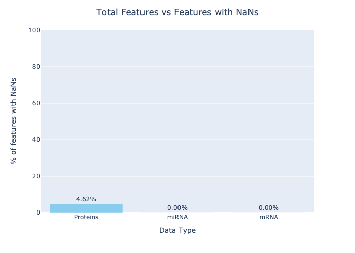
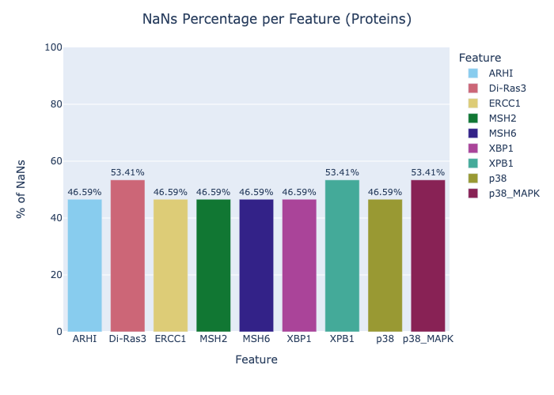
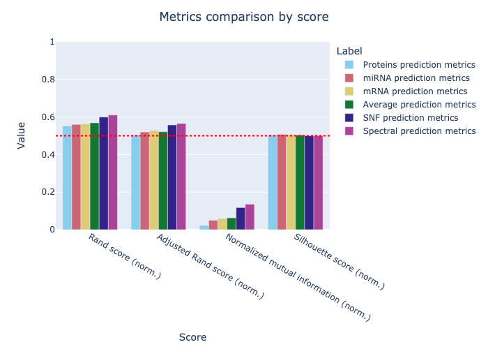

## INTRODUCTION
### Multi-omics data
The advent of multi-omics data has enabled the analysis and study of oncological patients not only from a clinical perspective but also from a molecular standpoint. The high dimensionality of the data allows for a comprehensive understanding of the dynamics that distinguish various types of tumors and the identification of new molecular markers that can be used for diagnosis and therapy. Therefore, the utilization of multi-omic data proves to be enabling for precision medicine (Correa-Aguila et al. [2]).
However, the heterogeneity of the data available today necessitates the study of specific integration techniques that allow for the exploitation of intra- and inter-omic information.

### Precision Medicine
Precision medicine is a novel patient treatment methodology based on the customization of therapy according to the individual characteristics of each patient (Ginsburg et al. [3]). In the field of oncology, the aim is to identify tumor subtypes and pinpoint the most effective therapies for each patient [4]. The analysis of multi-omic data is crucial for achieving this goal, as it allows for a more comprehensive and detailed understanding of the patient and their tumor.

### Tumor Subtype Identification
Given the considerable heterogeneity of tumors, it is necessary to identify their subtypes in order to develop targeted therapies. Subtypes of the same tumor can entail different prognoses and responses to therapies. Finding the most effective method for integrating the various types of data plays a fundamental role in achieving significant results. Obtaining a unified representation of the various aspects while preserving both the specific information of each 'view' and that which emerges from comparison with others is an ongoing challenge and the subject of numerous studies (Wörheide et al. [10]).

In addition to the challenge of data integration, it is also necessary to identify the best patient clustering technique to maximize tumor subtype identification. An aspect not to be underestimated in clustering is the strong dependence of the results on the chosen hyperparameters. The selection of these parameters is often based on empirical criteria and not always supported by scientific evidence, thus affecting the reproducibility of the results.

### The Cancer Genome Atlas (TCGA) Project
The Cancer Genome Atlas (TCGA) project is a research endeavor aimed at collecting multi-omic data concerning 33 types of tumors from over 85,000 patients. The open access to such a vast amount of data allows for the design and comparison of various analysis techniques, thus accelerating research in the field of oncology.

### Objectives
The aim of this experimentation is to compare different techniques for integrating multi-omic data and clustering patients in order to identify subtypes of prostate cancer. For the evaluation of the obtained clusters, it was chosen to use the subtypes previously identified through the iCluster framework.

## METHODS
### Data
The datasets used pertain to prostate cancer and were downloaded from the TCGA project. They are divided into:
- Proteomic (Protein expression)
- Transcriptomic (mRNA)
- Epigenomic (miRNA)
- Phenotype-related
- Tumor subtypes identified through the iCluster framework

#### Source Comparison
As evident from the table below [Table 1] and the plot [Fig. 1], the transcriptomic dataset exhibits significantly more features compared to the other two sources; this element could influence the integration results. While the abundance of features necessitates dimensionality reduction strategies, on the other hand, there is a higher likelihood of losing relevant information if the final number of features is very low.

|          | Patients | Features |
|----------|----------|----------|
| Proteins | 352      | 195      |
| miRNA    | 547      | 1046     |
| mRNA     | 550      | 20501    |  

*Tab. 1: features distribution*

*Fig. 1: features distribution*

#### Tumor Subtypes
The distribution of subtypes [Fig. 2] exhibits a significant percentage imbalance between subtypes 3 and 1, making it advisable to consider oversampling of the minority class and/or undersampling of subtype 3.

*Fig. 2: subtypes distribution*

#### iCluster
iCluster [7] is a framework that allows for the identification of tumor subtypes by integrating multi-omic data. The objective is to simultaneously consider:
- Variance of individual features
- Intra-omic covariance
- Inter-omic covariance

The idea is to leverage the information provided by individual sources without ignoring the interactions between them.
Given the need to manage a currently prohibitive amount of data, PCA (Principal Component Analysis) technique is applied to reduce the dimensionality of the data without losing significant information. Due to the use of a feature-extraction technique, the post-application dimensions are not the original ones but they project the data into a latent space.

### Preprocessing
Each data source is processed through a specific pipeline. The purpose of the pipelines is to standardize the data by removing samples that are not useful for experimentation while making the results reproducible.

#### miRNA, mRNA and Proteins pipelines

##### Missing values handling
The only data source that contains missing data is related to protein expression (4.5%) [Fig. 3].
Each of these features has at least 40% missing values [Fig. 4]; therefore, assuming that their removal does not result in a significant loss of information, they are eliminated from the dataset. This is a very strong assumption that should be thoroughly analyzed considering correlation indices such as the Pearson coefficient.

*Fig. 3: Sources missing values percentage*

*Fig. 4: Missing values in proteomic data*

##### Main Tumor Selection
To improve the comparability of samples, it was chosen to consider only samples related to the main tumor. This allows for the elimination of samples related to metastases or secondary tumors, which may present molecular characteristics different from the main tumor.

##### Dimensionality Reduction
As in iCluster, to facilitate the management of high-dimensional data such as the chosen ones, it was necessary to limit the number of features.
To ensure greater interpretability of the results by domain experts, it was preferred not to project the samples into a latent space but to perform a selection of the most significant features.
As in the previous step, an equally strong assumption was made: features with greater variability of values are the most significant.
This choice is intuitively supported by the fact that if, as the subtype varies, the values in a certain dimension remain constant, then they are not relevant.
For each feature of each source, the variance is calculated, and only the top 100 features with the highest variance are selected.

##### Barcode Truncation
The TCGA platform barcodes, consisting of 24 characters, contain unnecessary information for data integration. They are then truncated to 12 characters, which still allows for the unique identification of samples.

#### Phenotype Data Pipeline
In this case, since patient phenotype data are not subject to integration, the pipeline [Fig. 5] is much simpler.
The samples in the analyzed datasets were obtained through two different methodologies: FFPE (Formalin-Fixed Paraffin-Embedded) and freezing.
Since frozen samples preserve better, it was chosen to eliminate the FFPE samples. This allows for the subsequent removal of such samples from other datasets simply by intersecting the barcodes.

*Fig. 5: phenotype data pipeline*

#### Common Pipeline
Each source, including that of the subtypes, shares a preparation pipeline for integration [Fig. 6]. This pipeline modifies the structure of the datasets as follows:
1. Intersects the sample barcodes so that the sources share the same samples.
2. Orders the samples based on the barcode so that integration can be based on position, simplifying the integration pipeline.

Following this pipeline, 247 samples are retained.

*Fig. 6: common pipeline, usefull for further integrations*

### Similarity Matrices
Since every integration strategy implemented in the subsequent step requires the calculation of a similarity matrix for each source, it was chosen to make this step independent.
The similarity calculation is performed using the scaled exponential Euclidean distance, which allows for the calculation of the similarity between two samples based on the Euclidean distance between them. This metric was chosen because it is very common and therefore facilitates comparison with other methods, eliminating a variable from the comparison of results.

### Integration
It was decided to compare the following integration strategies:
- No integration
- Mean of similarity matrices
- SNF (Similarity Network Fusion)

#### No Integration
The underlying idea of non-integration is to analyze how each source allows for the identification of tumor subtypes compared to the results obtained by integrating the data in different ways. Given the successes in the field of classification of types and subtypes of multi-omic systems, it is reasonable to consider the performance of individual sources as a lower bound for the analyses.

#### Mean of matrices
One of the simplest methods to integrate different matrices is to simply take their mean. Taking the mean element-wise poses several challenges, including the fact that the relationships between the sources are not considered. This integration strategy is therefore useful as a baseline for comparing the performance of more complex and sophisticated methods.

#### Similarity Network Fusion
SNF (Wang et al. [9]) is proposed as an integration strategy capable of solving three main problems:
- Low signal-to-noise ratio
- Data on different scales and biases during collection
- Interdependence between sources

The algorithm consists of two main steps:
1. Calculation of the similarity matrix for each source.
2. Fusion of the similarity matrices.

In particular, the similarity matrices calculated for each source are used as a basis for building weighted graphs where the nodes are samples (in this experimentation, patients) and the edges represent the similarity between them. Each graph is then iteratively fused. In each iteration, the resulting graph is made as similar as possible to all others. The process continues until convergence.
SNF proves effective in eliminating source-specific noise (i.e., edges with low weights), maintaining the strongest relationships, and enhancing weak connections present in multiple sources.

### Clustering
To perform patient clustering, the K-medoids algorithm (Kaufman et al. [11]) was chosen.
The functioning of this algorithm is very similar to that of K-means (MacQueen et al. [5]), with the difference that clusters are formed starting from the *medoids*.
A medoid is a point in the dataset that minimizes the sum of distances between it and all other points in the cluster.
It is natural to associate K-means, and therefore centroids, with the concept of mean, while medoids with the median.
Just as the mean depends on the distribution of data and is therefore sensitive to outliers, the clusters identified by K-means will also be. Medoids, on the other hand, like the median, represent central values and are therefore independent from outliers.

However, K-medoids shares with K-means the need to specify the number of clusters to be identified. This is an open problem, and there is no unique solution. Moreover, the choice of the number of clusters is very important and can strongly influence the clustering results. In the specific case of this experimentation, the choice has been guided by the number of subtypes previously identified through iCluster.

#### Spectral Clustering
A test was also conducted with the Spectral Clustering algorithm (von Luxburg et al. [8]), but in this case, only on the data integrated via SNF.
Spectral Clustering is a clustering algorithm that leverages the structure of the data to identify clusters. The underlying idea of this algorithm is to project the data into a latent space, where clusters are more easily identifiable. In this new space, the data are then clustered using a traditional clustering algorithm. The Spectral Clustering algorithm is particularly effective at identifying non-convex clusters.

## RESULTS
### Evaluation Metrics
To assess the quality of the obtained clusters, the following metrics were chosen:
- Rand Index (Hubert et al. [14])
- Adjusted Rand Index (Hubert et al. [14])
- Normalized Mutual Information
- Silhouette Score (Rousseeuw [6])

#### Rand Index
The Rand Index is a metric that measures the similarity between two clusterings. The obtained value can vary between 0 and 1, where 0 indicates that the two clusterings are dissimilar, while 1 indicates that the two clusterings are identical.
It is defined as:
$$ RI = \frac{\alpha + \beta}{N} $$

Where:
- $\alpha$ is the number of pairs of elements that are in the same cluster in both clusterings
- $\beta$ is the number of pairs of elements that are in different clusters in both clusterings
- $N$ is the total number of pairs of elements

Being an intuitively defined metric, it was chosen to improve the interpretability of the results.

#### Adjusted Rand Index
The Adjusted Rand Index is a corrected version of the Rand Index that takes into account the fact that the Rand Index tends to be high even for random clusterings. More specifically, the RI is calculated, which is then *adjusted* with its expected value. In this way, the possibility that the clustering is due to chance is considered.
Its definition is:
$$ ARI = \frac{RI - E(RI)}{max(RI) - E(RI)} $$

#### Normalized Mutual Information
Normalized Mutual Information is a metric that measures the similarity between two clusterings. The obtained value can vary between 0 and 1, where 0 indicates that the two clusterings are dissimilar, while 1 indicates that the two clusterings are identical. It expresses how much the information in one clustering is useful for predicting the other one. So if the NMI is 1, there is a deterministic relationship between the two clusterings.
It is defined as:
$$ NMI = \frac{I(X;Y)}{\sqrt{H(X)H(Y)}} $$

The fact that this metric is not correct with respect to the expected value makes it more interpretable but less reliable [1].

#### Silhouette Score
Unlike the previous metrics, the Silhouette Score does not depend on a reference clustering. It measures the quality of the clustering based on the average distance between samples in the same cluster and the average distance between samples in different clusters. The obtained value can vary between -1 and 1.
A high value means that, on average, points are closer to their own cluster than to surrounding ones, a low value indicates that points are closer to different clusters than their own, while 0 indicates that points are equidistant from neighboring clusters and their own, so it is likely that two or more clusters are overlapping.

The score for each point is calculated as:
$$ S = \frac{b - a}{max(a, b)} $$

Where:
- $a$ is the average distance between a sample and all other samples in the same cluster
- $b$ is the average distance between a sample and all samples of the nearest clusters
- $max(a, b)$ is the maximum between the two distances

The Silhouette Score is the average of the values obtained for each sample.

### Results
#### Predictions without Integration
Both the Rand Index and the Adjusted Rand Index (normalized between 0 and 1) are around 0.5 [Fig. 7], which, considering that there are only 3 clusters, is quite low. Limiting the number of clusters to 3 and assuming a completely random classification, there would be approximately 33% chance of correctly assigning the correct label to any sample randomly. With an RI of about 0.5, it is only slightly better than a random classifier.
The Normalized Mutual Information confirms what can be deduced from the two previous indices, with values below 0.06. In each of the three indices, the dataset that led to slightly better results was the one related to mRNA, suggesting better informativeness of this source in the context.

Regarding the normalized Silhouette Score, the differences between the sources are essentially non-existent with values around 0.5 [Fig. 7]. Once again, the poor quality of clustering is confirmed as the clusters appear to be overlapping.

#### Integration via Mean
The results obtained with this type of integration [Fig. 7] are entirely comparable to those obtained by considering the sources separately, especially when considering the dataset related to mRNA. This suggests that averaging similarity matrices is not an effective method for integrating data.

#### Integration via SNF
More significant values are obtained with the data integrated via SNF, reaching an NMI of approximately 0.1 (although very low, double that of the previous methods) and a Rand Index of about 0.6 [Fig. 7]. However, the Silhouette Score is slightly lower, which suggests that the identified clusters are extremely close.

#### Clustering with Spectral Clustering
Using Spectral Clustering instead of K-medoids has led to slightly better results [Fig. 7], but almost indistinguishable, especially regarding the Silhouette Score. This method may prove more effective with a tuning phase of the numerous hyperparameters.

*Fig. 7: Metric comparison between integration methods*

#### Considerations on Silhouette Score
Such comparable values of Silhouette Score regardless of the integration method could indicate that one issue may be the mode of determining similarity between patients, as they are all identified as very different from each other [Fig. 8, 9, 10], especially in terms of protein activation, distributing them in the plane. Given the obtained results, further analysis of this index, such as examining the individual Silhouette Score values obtained for each sample compared to the clustering, was avoided.

*Fig. 8: Proteomic data similarity*

*Fig. 9: Epigenomica data similarity*

*Fig. 10: Transcriptomic data similarity*

### Possible Improvements
#### Feature Selection
A first improvement that could be made is a more accurate selection of features; instead of a fixed number of features per dataset, variable thresholds could be chosen based on the original dimensionality of the source. Alternatively, instead of considering variance as a proxy for the informativeness of a certain feature, dimensionality reduction could be based on other measures that consider the relationships between features, such as the Pearson correlation coefficient (Yule et al. [12]), thus selecting only features not expressed by others, avoiding redundant information and potential biases. At the cost of losing interpretability of the results, some assessable algorithms could be those of feature extraction such as PCA or nNMF; in this way, instead of losing potentially relevant features in favor of others, the data would be projected into a latent space with lower dimensionality but with minimal loss of information.

#### Clustering Algorithm
Further tests involve varying the clustering algorithm, using one whose convergence is not based on a predetermined number of clusters but on the distance between samples, such as DBSCAN (Ester et al. [13]), for example.

#### Integration
In both integration modalities, the choice was made to integrate the data upstream of the predictions; it would not be excluded to instead opt for posterior integration, that is, instead of integrating the data, try to integrate the clusterings. This would expose to the problem of having to choose how much importance to give to the predictions of each source, however, it would allow the exploitation of previous studies and knowledge on the application context.

## CONCLUSIONS
The results obtained are considered unsatisfactory, as none of the integration strategies led to significantly better scores than the others. The consistency in Silhouette Scores suggests a fundamental problem in determining the similarity between samples. While the other indices, considering the subtypes identified by iCluster, attest to the inapplicability of the methods implemented in the selected context.

## REFERENCES
- [1] Amelio, A. and Pizzuti, C. (2015) ‘Is normalized mutual information a fair measure for comparing community detection methods?’, Proceedings of the 2015 IEEE/ACM International Conference on Advances in Social Networks Analysis and Mining 2015. doi:10.1145/2808797.2809344. 

- [2] Correa-Aguila, R., Alonso-Pupo, N. and Hernández-Rodríguez, E.W. (2022) ‘Multi-omics data integration approaches for precision oncology’, Molecular Omics, 18(6), pp. 469–479. doi:10.1039/d1mo00411e. 

- [3] Ginsburg, G. (2001) ‘Personalized medicine: Revolutionizing drug discovery and patient care’, Trends in Biotechnology, 19(12), pp. 491–496. doi:10.1016/s0167-7799(01)01814-5. 

- [4] Jiang, F. et al. (2022) ‘Integrated analysis of multi-omics data to identify prognostic genes for pancreatic cancer’, DNA and Cell Biology, 41(3), pp. 305–318. doi:10.1089/dna.2021.0878. 

- [5] MacQueen, J. (1967) Some methods for classification and analysis of multivariate observations. 

- [6] Rousseeuw, P.J. (1987) ‘Silhouettes: A graphical aid to the interpretation and validation of cluster analysis’, Journal of Computational and Applied Mathematics, 20, pp. 53–65. doi:10.1016/0377-0427(87)90125-7. 

- [7] Shen, R., Olshen, A.B. and Ladanyi, M. (2009) ‘Integrative clustering of multiple genomic data types using a joint latent variable model with application to breast and lung cancer subtype analysis’, Bioinformatics, 25(22), pp. 2906–2912. doi:10.1093/bioinformatics/btp543. 

- [8] von Luxburg, U. (2007) ‘A tutorial on spectral clustering’, Statistics and Computing, 17(4), pp. 395–416. doi:10.1007/s11222-007-9033-z. 

- [9] Wang, B. et al. (2014) ‘Similarity network fusion for aggregating data types on a genomic scale’, Nature Methods, 11(3), pp. 333–337. doi:10.1038/nmeth.2810. 

- [10] Wörheide, M.A. et al. (2021) ‘Multi-omics integration in biomedical research – a metabolomics-centric review’, Analytica Chimica Acta, 1141, pp. 144–162. doi:10.1016/j.aca.2020.10.038. 
 
- [11] Kaufman, L. and Rousseeuw, P.J. (1990) ‘Finding groups in Data’, Wiley Series in Probability and Statistics [Preprint]. doi:10.1002/9780470316801. 

- [12] G. Udny Yule, 'On the theory of correlation for any number of variables, treated by a new system of notation'. (1907). Proceedings of the Royal Society of London, 79(529), 182–193. doi:10.1098/rspa.1907.0028

- [13] Ester, M., H. P. Kriegel, J. Sander, and X. Xu, “A Density-Based Algorithm for Discovering Clusters in Large Spatial Databases with Noise”. In: Proceedings of the 2nd International Conference on Knowledge Discovery and Data Mining, Portland, OR, AAAI Press, pp. 226-231. 1996

- [14] Hubert, L. and Arabie, P. (1985) ‘Comparing partitions’, Journal of Classification, 2(1), pp. 193–218. doi:10.1007/bf01908075. 