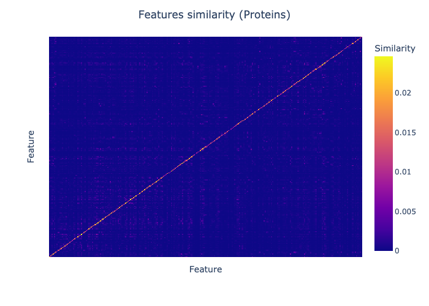

## INTRODUZIONE
### Dati multi-omici
L'avvento dei dati multi omici, ha permesso di analizzare e studiare i pazienti oncologici non solo dal punto di vista clinico, ma anche molecolare.
L'elevata dimensionalità dei dati, permette così di comprendere a fondo le dinamiche che contraddisitnguono le diverse tipologie di tumori, e di individuare nuovi marcatori molecolari che possano essere utilizzati per la diagnosi e la terapia; lo sfruttamento dei dati multi-omici si rivela quindi abilitante per la medicina di precisione [2]. 
L'eterogeneità dei dati oggi a disposizione, rende però necessario lo studio di specifiche tecniche di integrazione che permettano di sfruttare le informazioni infra e inter-omiche.

### Medicina di precisione
La medicina di precisione è una nuova metodologia di trattamento del paziente che si basa sulla personalizzazione della terapia in base alle caratteristiche peculiari dello stesso [3]. In campo oncologico, l'obiettivo è quello di identificare i sottotipi di tumore e di individuare le terapie più efficaci per ciascun paziente [4]. L'analisi dei dati multi-omici è fondamentale per raggiungere questo obiettivo, in quanto permette di ottenere una visione più completa e dettagliata del paziente e del suo tumore.

#### Identificazione sottotipi di tumore
Vista la notevole eterogeneità dei tumori, è necessario identificarne i sottotipi, in modo da poter creare terapie mirate. Sottotipi di uno stesso tumore possono implicare differenti prognosi e risposte alle terapie. Anche in questo caso, trovare il metodo più efficace per integrare le diverse tipologie dei dati gioca un ruolo fondamentale nel raggiungimento di risultati significativi. Ottenere una rappresentazione unificata dei vari aspetti, preservando le informazioni sia speicifiche di ogni 'vista' che quelle che emergono dal confronto con le altre è una sfida aperta e oggetto di numerosi studi [10].

Oltre alla problematica dell'integrazione dei dati, è anche necessario inidividuare la tecnica migliore di clustering dei pazienti per massimizzare l'identificazione dei sottotipi di tumore. Un aspetto da non sottovalutare nel clustering è la forte dipendenza dei risultati dagli iperparametri scelti. La scelta di questi ultimi è spesso basata su criteri empirici e non sempre supportata da evidenze scientifiche, intaccando la riproducibilità dei risultati.

### Progetto TCGA
Il progetto TCGA (The Cancer Genome Atlas) è un progetto di ricerca che ha lo scopo di raccogliere dati multi-omici riguardanti 33 tipologie di tumore su più di 85000 pazienti.
L'accesso libero a tale quantità di dati, permette di ideare e confrontare diverse tecniche di analisi accelerando così la ricerca in campo oncologico.

### Obiettivi
L'obiettivo di questa sperimentazione è quello di confrontare diverse tecniche di integrazione di dati multi-omici e di clustering dei pazienti, al fine di identificare i sottotipi di tumore alla prostata. Per la valutazione dei cluster ottenuti, è stato scelto di utilizzare i sottotipi precedentemente individuati tramite il framework iCluster.

## METODI
### Dati
I dataset utilizzati riguardano il tumore alla prostata e sono stati scaricati dal progetto TCGA. Si suddividono in:
- Proteomici (Espressione proteica)
- Trascrittomici (mRNA)
- Epigenomici (miRNA)
- Riguardo il fenotipo
- Sottotipi di tumore individuati tramite framework iCluster

#### Confronto sorgenti
Come è possibile notare dalla tabella sottostante[Tab. 1] e dal grafico [Fig. 1] , il dataset riguardo i dati trascrittomici presenta molte più feature rispetto alle altre due sorgenti; questo elemento potrebbe influenzare i risultati dell'integrazione. Se da un lato, la numerosità delle feature rende necessario mettere in atto strategie di riduzione della dimensionalità, dall'altro, è più probabile perdere informazioni rilevanti se il numero finale di feature è molto basso.

|          | Pazienti | Features |
|----------|----------|----------|
| Proteine | 352      | 195      |
| miRNA    | 547      | 1046     |
| mRNA     | 550      | 20501    |  

*Tab. 1: distribuzione features nelle sorgenti omiche*

*Fig. 1: distribuzione features nelle sorgenti omiche*

#### Sottotipi di tumore
La distribuzione dei sottotipi [Fig. 2] presenta uno sbilanciamente percentuale rilevante tra i sottotipi 3 e 1 il che rende consigliabile valutare l'oversampling della classe minoritara e/o l'undersampling del sottotipo 3.  

*Fig. 2: distribuzione sottotipi di tumore*

#### iCluster
iCluster [7] è un framework che permette di dentificare sottotipi di tumore integrando dati multi-omici. L'obiettivo è quello di considerare contemporaneamente:
- Varianza delle singole feature
- Covarianza intra-omica
- Covarianza inter-omica

L'idea è quella di sfruttare l'informazione data dalle singole fonti, senza ignorare le interazioni tra di esse.
Vista la necessità di gestire una mole di dati attualmente proibitiva, viene applicata la tecnica PCA in modo da ridurre la dimensionalità dei dati, senza perdere informazioni significative. Visto l'utilizzo di una tecnica di feature-extraction, le dimensioni post applicazione non sono quelle originali ma proiettano il dato in uno spazio latente.

### Preprocessing
Ogni sorgente di dati, viene processata attraverso una specifica pipeline. Lo scopo delle pipeline è quello di uniformare i dati eliminando i risultati relativi a campioni non utili ai fini della sperimentazione rendendo al contempo i risultati riproducibili.

#### Pipeline miRNA, mRNA, dati proteomici

##### Gestione valori mancanti
L'unica sorgente che presenta dati mancanti è quella relativa all'espressione proteica (4.5%)[Fig. 3]. 
Ognuna di tali feature, presenta almeno il 40% di valori mancanti [Fig. 4]; perciò assumendo che la loro rimozione non comporti una perdita significativa di informazione, vengono eliminate dal dataset. Questa è un'assunzione molto forte che andrebbe analizzata a fondo considerando indici di correlazione come il coefficiente di Pearson.

*Fig. 3: percentuale di valori mancanti per feature nel dataset proteomico*

*Fig. 4: percentuale di valori mancanti per feature nel dataset proteomico*

##### Selezione tumore principale
Per migliorare la comparabilità dei campioni, si è scelto di considerare solo i campioni relativi al tumore principale. Questo permette di eliminare campioni relativi a metastasi o a tumori secondari, che potrebbero presentare caratteristiche molecolari diverse rispetto al tumore principale.

##### Riduzione di dimensionalità
Come accade in iCluster, per facilitare la gestione di dati ad alta dimensionalità come quelli scelti; si è reso necessario limitare il numero di feature.
Per garantire una maggiore interpretabilità dei risultati da parte di persone esperte del dominio, si è preferito non proiettare i campioni in uno spazio latente, ma attuare una selezione delle feature più significative.
Come nello step precedente, si è fatta un'assunzione altrettanto forte: le feature con una maggiore variabilità dei valori sono quelle più significative.
Questa scelta viene supportata a livello intuitivo dal fatto che se, al variare del sottotipo, i valori in una certa dimensione rimangono costanti, allora essi non sono rilevanti.
Per ogni feature di ogni sorgente viene quindi calcolata la varianza e vengono selezionate solo le prime 100 feature con la maggiore varianza.

##### Troncamento barcode
I barcode della piattaforma TCGA, costituiti da 24 caratteri, contengono informazioni non necessarie per l'integrazione dei dati. Vengono quindi troncati a 12 caratteri, il che permette comunque di identificare univocamente i campioni.

#### Pipeline dati fenotipo
In questo caso, dato che i dati relativi al fenotipo dei pazienti non sono oggetto di integrazione, la pipeline [Fig. 5] risulta molto più semplice.
I campioni presenti nei dataset analizzati sono stati conservati tramite due metodologie diverse: FFPE e congelamento. 
Dato che i campioni congelati si conservano meglio, si è scelto di eliminare i campioni FFPE. Questo permette in un secondo momento, di eliminare tali campioni anche dagli altri dataset semplicemente intersecando i barcode.

*Fig. 5: pipeline dati fenotipo*

#### Pipeline comune
Ogni sorgente, compresa quella dei sottotipi, condivide una pipeline di preparazione all'integrazione [Fig. 6]. Tale pipeline modifica la struttura dei dataset come segne:
1. Interseca i barcode dei campioni in modo tale che le sogenti condividano gli stessi campioni
2. Ordina i campioni in base al barcode in modo tale che l'integrazione si possa basare sulla posizione, semplificando la pipeline d'integrazione

A seguito di tale pipeline, vengono conservati 247 campioni.

*Fig. 6: pipeline comune di preparazione all'integrazione*

### Matrici di similarità 
Siccome ogni strategia di integrazione messa in atto nello step successivo richiede il calcolo di una matrice di similarità per ogni sorgente, si è scelto di rendere indipendente tale passaggio.
Il calcolo della similarità avviene tramite la scaled exponential euclidean distance, che permette di calcolare la similarità tra due campioni in base alla distanza euclidea tra di essi. È stata scelta questa metrica perchè molto comune e quindi facilita il confronto con altri metodi, eliminanodo una variabile dalla comparazione dei risultati.

### Integrazione
Si è deciso di confrontare le seguenti strategie di integrazione:
- Non integrazione
- Media delle matrici di similarità
- SNF (Similarity Network Fusion)

#### Non integrazione
L'idea alla base della non integrazione è quella di analizzare come ogni sorgente permetta di identificare i sottotipi di tumore rispetto ai risultati ottenuti integrando i dati in modi diversi. Dati i successi nel campo della classificazione dei tipi e sottotipi dei sistemi multi-omici, è lecito considerare le performance delle singole sorgenti come lower bound per le analisi. 

#### Media matrici
Uno dei metodi più semplici per integrare matrici diverse è quello di farne semplicemente la media. Fare la media elemento per elemento comporta diverse problematiche, tra cui il fatto che non vengono tenute in considerazione le relazioni tra le sorgenti.  
Questa strategia di integrazione è quindi utile come baseline per confrontare le performance di metodi più complessi e sofisticati.

#### Similarity Network Fusion
SNF [9] si propone come strategia di integrazione in grado di risolvere tre problemi principali:
- Rapporto segnale/rumore basso
- Dati su scale diverse e bias durante il collezionamento
- Interdipendenza tra le sorgenti

L'algritmo si compone di due step principali:
1. Calcolo della matrice di similarità per ogni sorgente
2. Fusione delle matrici di similarità

In particolare, le matrici di similarità calcolate per ogni sorgente, vengono usate come base per la costruzione di grafi pesati dove i nodi sono i campioni (nella presente sperimentazione, i pazienti) e gli archi rappresentano la similarità tra di essi. Ogni grafo viene poi *fuso* iterativamente. Ad ogni iterazione il grafo risultante viene reso il più simile possibile a tutti gli altri. Il processo continua fino a convergenza.
SNF si dimostra efficace nell'elminare rumori specifici delle sorgenti (ovvero archi con pesi bassi), mantenimento delle relazioni più forti ed esaltazione di connessioni deboli ma presenti in più sorgenti.

### Clustering
Per effettuare il clustering dei pazienti, si è scelto di utilizzare l'algorimto K-medoids [11].
Il funzionamento di tale algoritmo è molto simile a quello di K-means [5], con la differenza che i cluster vengono formati partendo dai *medoidi*.
Un medoide, è un punto del dataset che minimizza la somma delle distanze tra esso e tutti gli altri punti del cluster.
Risulta naturale associare K-means e quindi i centroidi con il concetto di media, mentre i medoidi con la mediana.
Così come la media dipende dalla distribuzione dei dati e quindi è sensibile agli outliers, anche i cluster identificati da K-means lo saranno.
I medoid invece, come la mediana, rappresentano i valori centrali e sono quindi indipendenti dagli outliers.

K-medoids tuttavia condivide con K-means la necessità di specificare il numero di cluster da identificare. Questo è un problema aperto e non esiste una soluzione univoca. Inoltre, la scelta del numero di cluster è molto importante e può influenzare fortemente i risultati del clustering. Nel caso specifico della presente sperimentazine la scelta è stata guidata dal numero di sottotipi precedentemente identificati tramite iCluster.

#### Spectral Clustering
È stato anche effettuato un test con l'algoritmo di Spectral Clustering [8], ma in questo caso solo sui dati integrati tramite SNF.
Spectral Clustering è un algoritmo di clustering che sfrutta la struttura dei dati per identificare i cluster. L'idea alla base di questo algoritmo è quella di proiettare i dati in uno spazio latente, dove i cluster sono più facilmente identificabili. In questo nuovo spazio, i dati vengono poi clusterizzati tramite un algoritmo di clustering tradizionale. L'algoritmo di Spectral Clustering è particolarmente efficace nell'identificare cluster non necessariamente convessi.

## RISULTATI
### Metriche di valutazione
Per valutare la qualità dei cluster ottenuti, si è scelto di utilizzare le seguenti metriche:
- Rand Index [3]
- Adjusted Rand Index [3]
- Normalized Mutual Information 
- Silhouette Score [6]

#### Rand Index
Il Rand Index è una metrica che misura la similarità tra due clustering. Il valore ottenuto può variare tra 0 e 1, dove 0 indica che i due clustering non sono simili, mentre 1 indica che i due clustering sono identici.
Viene definito come:
$$ RI = \frac{\alpha + \beta}{N} $$

Dove:
- $\alpha$ è il numero di coppie di elementi che sono nello stesso cluster in entrambi i clustering
- $\beta$ è il numero di coppie di elementi che sono in cluster diversi in entrambi i clustering
- $N$ è il numero totale di coppie di elementi

Essendo una metrica dalla definizione intuitiva, è stata scelta per migliorare l'interpretabilità dei risultati.

#### Adjusted Rand Index
L'Adjusted Rand Index è una versione corretta del Rand Index che tiene conto del fatto che il Rand Index tende ad essere alto anche per clustering casuali. Più nello specifico, viene calcolato il RI, che viene poi *corretto* con il suo valore attesto. In questo modo viene considerata l'eventualità che il clustering sia frutto del caso.  
La sua definizione è:  
$$ ARI = \frac{RI - E(RI)}{max(RI) - E(RI)} $$

#### Normalized Mutual Information
La Normalized Mutual Information è una metrica che misura la similarità tra due clustering. Il valore ottenuto può variare tra 0 e 1, dove 0 indica che i due clustering non sono simili, mentre 1 indica che i due clustering sono identici. Esprime quanto le informazioni di un clustering siano utili per prevedere l'altro. Quindi se l' NMI è 1, esiste una relazione deterministica tra i due clustering.  
Viene definita come:  
$$ NMI = \frac{I(X;Y)}{\sqrt{H(X)H(Y)}} $$

Il fatto che questa metrica non sia corretta rispetto al lavoro atteso, la rende più interpretabile ma meno affidabile [1].

#### Silhouette Score
Differentemente dalle precedenti metriche, il Silhoutte Score non dipende da un clustering di riferimento. Misura la qualità del clustering in base alla distanza media tra i campioni di uno stesso cluster e la distanza media tra i campioni di cluster diversi. Il valore ottenuto può variare tra -1 e 1.
Un valore alto significa che, mediamente, i punti sono più vicini al proprio cluster rispetto a quelli circostanti, un valore basso indica che i punti sono più vicini a cluster diversi rispetto a quello di appartenenza mentre 0 indica che i punti sono equidistanti dai cluster vicini e quello di appartenenza e quindi è probabile che due o più cluster siano sovrapposti.

Lo score per ogni punto viene calcolato come:  
$$ S = \frac{b - a}{max(a, b)} $$

Dove:
- $a$ è la distanza media tra un campione e tutti gli altri campioni nello stesso cluster
- $b$ è la distanza media tra un campione e tutti i campioni dei cluster vicini
- $max(a, b)$ è il massimo tra le due distanze

Il Silhouette Score è la media dei valori ottenuti per ogni campione.

### Risultati
#### Predizioni senza integrazione
Sia il Rand Index che l'Adjusted Rand Index (normalizzato tra 0 e 1) sono nell'intorno di 0.5 [Fig. 7], il che, considerando il fatto che i cluster sono solo 3, è abbastanza basso. Limitando il numero di cluster a 3 e ipotizzando una classificazione del tutto casuale, si avrebbe il 33% circa di probabilità di associare l'etichetta corretta ad un qualsiasi campione, essendo il RI di circa 0.5, si è di poco meglio di un classificatore casuale.
La Normalized Mutual Information conferma quanto deducibile dai due indici precedenti, con valori inferiori a 0.06. In ognuno dei tre indici, il dataset che ha portato a risultati leggerissimamente migliori è stato quello relativo al mRNA, suggerendo una migliore informatività di tale sorgente in merito al contesto.

Per quanto riguarda il Silhouette Score normalizzato, le differenze tra le sorgenti sono sostanzialmente inesistenti con valori nell'intorno di 0.5 [Fig. 7]. Anche in questo caso viene confermata la scarsa qualità del clustering visto che i cluster risultano sovrapposti.

#### Integrazione tramite media
I risultati ottenuti con questo tipo di integrazione [Fig. 7] sono del tutto comparabili con quelli ottenuti considerando le sorgenti in maniera disgiunta, soprattuto se si considera il dataset riguardante i dati su mRNA. Questo suggerisce che la media delle matrici di similarità non sia un metodo efficace per integrare i dati.

#### Integrazione tramite SNF
Valori più rilevanti vengono ottenuti con i dati integrati tramite SNF, con i quali si raggiunge una NMI di circa 0.1 (seppur molto bassa, il doppio dei metodi precedenti) e un Rand Index di circa 0.6 [Fig. 7]. Nonostante questo però il Silhoutte Score è leggermente più basso, il che permette di ipotizzare che i cluster individuati siano estremamente vicini.

#### Clustering con Spectral Clustering
Utilizzare Spectral Clustering invece di K-medoids ha portato a risultati leggermente migliori [Fig. 7], ma quasi indistinguibili, soprattutto per quanto riguarda il Silhouette Score. Tale metodo potrebbe risultare più efficace a fronte di una fase di tuning dei numerosi iperparametri.

*Fig. 7: Confronto metriche misurate a seguito dei diversi metodi analizzati*

#### Considerazioni Silhouette Score
Valori così comparabili di Silhouette score a prescindere dal metodo di integrazione potrebbe significare che un problema presente sia la modalità di determinazione della similarità tra i pazienti, che vengono infatti identificati tutti molto diversi tra di loro [Fig. 8, 9, 10] soprattutto sotto il profilo di attivazione proteica, distribuendoli nel piano. Visto quanto ottenuto, si è evitato di approfondire ulteriormente l'analisi di questo indice, analizzando ad esempio i singoli valori di Silhouette Score ottenuti per ogni campione rispetto alla clusterizzazione.

*Fig. 8: Similarità tra i pazienti nel dataset proteomico*

*Fig. 9: Similarità tra i pazienti nel dataset miRNA*

*Fig. 10: Similarità tra i pazienti nel dataset mRNA*

### Possibili miglioramenti
#### Selezione feature
Un primo miglioramento che potrebbe essere apportato è una selezione più accurata delle feature; invece che un numero fisso di feature per dataset, si potrebbe optare per soglie variabili in base alla dimensionalità orginale della sorgente. Oppure invece di considerare la varianza come proxy dell'informatività di una certa feature, la riduzione di dimensionalità potrebbe essere fatta sulla base di altre grandezze che considerano le relazioni tra le feature, come l'indice di correlazione di Pearson [12], selezionando così solo le feature non espresse da altre evitando informazioni ridondanti e quindi eventuali bias.
Al costo di perdere interpretabilità dei risultati, alcuni algoritmi valutabili potrebbero essere quelli di feature extraction come PCA o nNMF, in questo modo, invece di perdere feature potenzialmente rilevanti in favore di altre, i dati verrebbero proiettati in uno spazio latente a minore dimensionalità ma con una perdita minima di informazione.

#### Algoritmo di clustering
Ulteriori test consistono in variare l'algoritmo di clustering, utilizzandone ad esempio uno la cui convergenza non si basi su un numero prescelto di cluster ma sulla distanza tra i sample, come ad esempio DBSCAN [13].

#### Integrazione
In entrambe le modalità di integrazione, si è optato per integrare i dati a monte delle predizioni; non sarebbe da escludere invece l'integrazione a posteriori, ovvero invece di integrare i dati, cercare di integrare i clustering. Ciò esporrebbe al problema di dover scegliere quanta importanza dare alle predizioni di ogni sorgente, tuttavia permetterebbe lo sfruttamente di studi e conoscenze pregresse sul contesto di applicazione.

## CONCLUSIONI
I risultati ottenuti sono considerabili insoddisfacenti, in quanto nessuna delle strategie di integrazione ha portato a score significativamente migliori rispetto alle altre.
La costanza nei Silhouette Score suggerisce un problema di fondo nella determinazione della similarità tra i campioni. Mentre gli altri indici, considerando i sottotipi identificati da iCLuster, attestano l'inapplicabilità dei metodi messi in atto nel contesto selezionato.

## BIBLIOGRAFIA
- [1] Amelio, A. and Pizzuti, C. (2015) ‘Is normalized mutual information a fair measure for comparing community detection methods?’, Proceedings of the 2015 IEEE/ACM International Conference on Advances in Social Networks Analysis and Mining 2015. doi:10.1145/2808797.2809344. 

- [2] Correa-Aguila, R., Alonso-Pupo, N. and Hernández-Rodríguez, E.W. (2022) ‘Multi-omics data integration approaches for precision oncology’, Molecular Omics, 18(6), pp. 469–479. doi:10.1039/d1mo00411e. 

- [3] Ginsburg, G. (2001) ‘Personalized medicine: Revolutionizing drug discovery and patient care’, Trends in Biotechnology, 19(12), pp. 491–496. doi:10.1016/s0167-7799(01)01814-5. 
Hubert, L. and Arabie, P. (1985) ‘Comparing partitions’, Journal of Classification, 2(1), pp. 193–218. doi:10.1007/bf01908075. 

- [4] Jiang, F. et al. (2022) ‘Integrated analysis of multi-omics data to identify prognostic genes for pancreatic cancer’, DNA and Cell Biology, 41(3), pp. 305–318. doi:10.1089/dna.2021.0878. 

- [5] MacQueen, J. (1967) Some methods for classification and analysis of multivariate observations. 

- [6] Rousseeuw, P.J. (1987) ‘Silhouettes: A graphical aid to the interpretation and validation of cluster analysis’, Journal of Computational and Applied Mathematics, 20, pp. 53–65. doi:10.1016/0377-0427(87)90125-7. 

- [7] Shen, R., Olshen, A.B. and Ladanyi, M. (2009) ‘Integrative clustering of multiple genomic data types using a joint latent variable model with application to breast and lung cancer subtype analysis’, Bioinformatics, 25(22), pp. 2906–2912. doi:10.1093/bioinformatics/btp543. 

- [8] von Luxburg, U. (2007) ‘A tutorial on spectral clustering’, Statistics and Computing, 17(4), pp. 395–416. doi:10.1007/s11222-007-9033-z. 

- [9] Wang, B. et al. (2014) ‘Similarity network fusion for aggregating data types on a genomic scale’, Nature Methods, 11(3), pp. 333–337. doi:10.1038/nmeth.2810. 

- [10] Wörheide, M.A. et al. (2021) ‘Multi-omics integration in biomedical research – a metabolomics-centric review’, Analytica Chimica Acta, 1141, pp. 144–162. doi:10.1016/j.aca.2020.10.038. 
 
- [11] Kaufman, L. and Rousseeuw, P.J. (1990) ‘Finding groups in Data’, Wiley Series in Probability and Statistics [Preprint]. doi:10.1002/9780470316801. 

- [12] On the theory of correlation for any number of variables, treated by a new system of notation. (1907). Proceedings of the Royal Society of London, 79(529), 182–193. doi:10.1098/rspa.1907.0028

- [13] Ester, M., H. P. Kriegel, J. Sander, and X. Xu, “A Density-Based Algorithm for Discovering Clusters in Large Spatial Databases with Noise”. In: Proceedings of the 2nd International Conference on Knowledge Discovery and Data Mining, Portland, OR, AAAI Press, pp. 226-231. 1996